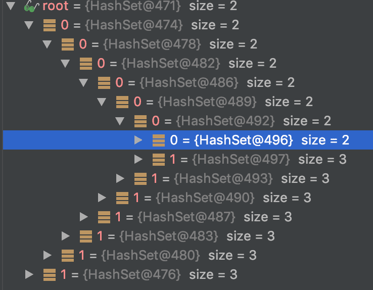

### 12장 : 직렬화
# 🍀 [아이템 85] 자바 직렬화의 대안을 찾으라 

## 📒 자바 직렬화는 위험하다
### 📃 공격 범위가 너무 넓고 지속적으로 더 넓어져 방어하기 어렵다
- `ObjectInputStream`의 `readObject` 메서드를 호출하면서 객체가 역직렬화
- `readObject` 메서드(Serializable을 구현한 경우)는 클래스패스 안의 거의 모든 타입의 객체를 만들어낼 수 있음
=> 해당 타입의 코드 전체가 공격 범우에 들어간다

## 📒 역직렬화 문제
### 📃 가젯 Godject
> 역직렬화 과정에서 호출되어 잠재적인 위험한 행동을 수행하는 메서드

=> 아주 신중하게 제작된 바이트 스트림만 역직렬화해야 한다

### 📃 역직렬화 폭탄
> 역직렬화에 시간이 오래 걸리는 짧은 스트림 
```java
static byte[] bomb() {
    Set<Object> root = new HashSet<>();
    Set<Object> s1 = root;
    Set<Object> s2 = new HashSet<>();

    for (int i=0; i < 100; i++) {
        Set<Object> t1 = new HashSet<>();
        Set<Object> t2 = new HashSet<>();

        t1.add("foo"); // t1을 t2과 다르게 만든다.
        s1.add(t1); s1.add(t2);

        s2.add(t1); s2.add(t2);
        s1 = t1; s2 = t2;
    }
    return serialize(root);
}
```
`serializ` 메서드가 수행되기 전의 인스턴스 참조 형태를 보면 아래와 같은 형태인데, 이 깊이가 100단계까지 만들어짐

(출처 : https://madplay.github.io/post/prefer-alternatives-to-java-serialization)

=> 역직렬화가 영원히 계속된다는 것도 문제지만, 무언가 잘못되었다는 신호조차 주지 않는 것도 문제이다

# 📒 직렬화 위험을 회피하는 방법
- 아무것도 역직렬화하지 않기
- 객체의 바이트 시퀀스를 변환해주는 다른 메커니즘이 많이 있다
    - 임의 객체 그래프를 자동으로 직렬화/역직렬화하지 않는다
    - 대신 속성-값 쌍의 집합으로 구성된 간단하고 구조화된 객체 사용

# 📒 Cross-Platform Structured-Data Representation
- 자바 직렬화는 크로스-플랫폼 구조화된 데이터 표현 방법으로 대체해야 한다.
- ex) JSON, protocol buffer
- 프로토콜 버퍼는 이진 표현이라 효율이 훨씬 높으며 JSON은 텍스트 기반이라 사람이 읽을 수 있다.

# 📒 직렬화를 절대 대체할 수 없다면
오래된 시스템으로 자바 직렬화를 사용할 수밖에 없다면 반드시 신뢰할 수 있는 데이터만 역직렬화해야 한다.

직렬화를 피할 수 없고 역직렬화한 데이터가 안전하지 확실할 수 없다면 객체 역직렬화 필터링을 사용하면 된다. 자바 9에 추가되었고, 이전 버전에서도 사용할 수 있도록 이식되었다. 데이터 스트림이 역직렬화되기 전에 필터를 수행하여 특정 클래스만 수용하거나 제외하도록 할 수 있다.

=> 직렬화는 위험 요소가 많으므로 시간과 노력을 쏟더라도 JSON으로 마이그레이션하자