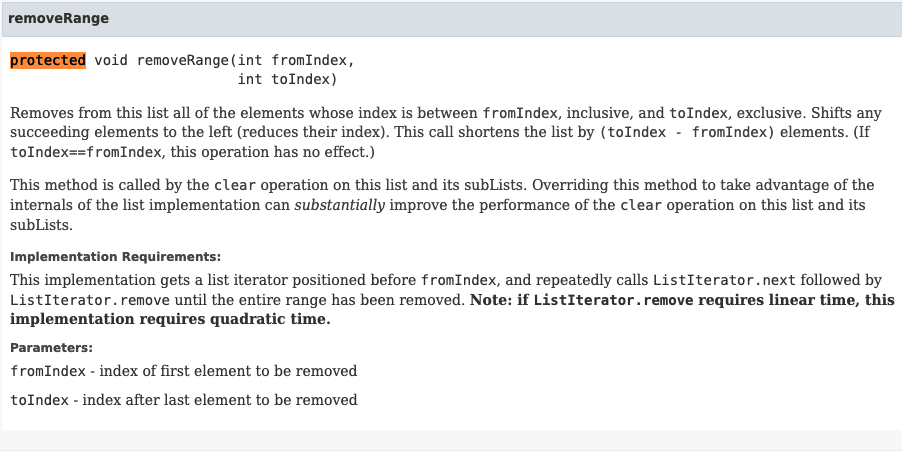

### 4장 : 클래스와 인터페이스
# 🍀 [아이템 19]  상속을 고려해 설계하고 문서화하라. 그러지 않았다면 상속을 금지시켜라.

## 📒 상속용 클래스는 재정의할 수 있는 메서드들을 내부적으로 어떻게 이용하는지(자가사용) 문서로 남겨야 한다
> 재정의 가능 메서드를 호출할 수 있는 모든 상황을 문서로 남겨야한다.

[상속 문서화 주요내용]

- 재정의 가능여부
- 호출 순서
- 호출 결과의 영향

API 문서의 메서드 설명 끝에서 종종 Implementation Requirements 로 시작하는 절을 볼 수 있는데, 해당 메서드의 내부 동작 방식을 설명하는 곳이다.

이 절은 메서드 주석에 `@implSpec` 태그를 붙이면 자바독 도구가 자동으로 생성해준다.

### 📃 하지만...
좋은 API문서란 [어떻게] 가 아닌 [무엇] 을 하는지를 설명해야한다. <br>
클래스를 안전하게 상속할 수 있도록 하려면 (상속만 아니었다면 기술하지 않았어야 할) 내부구현 방식을 설명해야만 한다.

## 📒 효율적인 하위 클래스를 만들려면?
 내부 매커니즘을 문서로 남기는것뿐만 아니라 클래스의 내부 동작 과정 중간에 끼어들 수 있는 훅(hook)을 잘 선별하여 protected 메서드 형태로 공개해야 할 수도 있다.

 

### 📃 protected로 노출해야 하는 메서드 선택 방법
- protected 메서드마다 구현해야 하므로 그 수는 가능한 한 적어야 한다
- 🔥 직접 하위 클래스를 만들어서 시험해야 한다 (유일한 방법) 🔥 
    - 3개 정도가 적당하다
- 꼭 필요한 protected 멤버를 놓쳤다면 하위 클래스 작성시 그 빈자리가 드러난다.
- 하위 클래스를 여러 개 만들 때까지 전혀 쓰이지않는 protected 멤버는 사실 `private`이어야 할 가능성이 크다.

### 📃 상속용 설계 클래스는 검증이 반드시 필요하다
- 널리 쓰일 클래스를 상속용으로 설계한다면 문서화한 내부 사용 패턴과, `protected` 메서드와 필드를 구현하면서 선택한 결정에 영원히 책임져야한다.
- 상속용 클래스를 설계하면서 한 결정들이 그 클래스의 성능과 기능에 족쇄가 될 수 있다.
- 상속용으로 설계한 클래스는 배포 전에 반드시 하위 클래스를 만들어 검증해야 한다.

### 📃 상속용 클래스 생성자는 재정의 가능 메서드를 호출해서는 안된다.
- 상위 클래스의 생성자가 하위 클래스의 생성자보다 먼저 실행되므로 하위 클래스에서 재정의한 메서드가 하위 클래스 생성자보다 먼저 실행된다.
- 재정의한 메서드가 하위 클래스의 생성자에서 초기화하는 값에 의존한다면 의도대로 동작하지 않는다.
- 상속용 클래스의 생성자는 직간접적으로 재정의 가능 메서드를 호출해서는 안된다.
<br><br>
```java
[생성자가 재정의 가능 메서드를 호출한다.]

public class Super {
    public Super() {
        override();
    } // 생성자가 재정의 가능 메서드 호출
    
    public void override(){
        
    }
}
```
```java
[override 메서드를 재 정의한 하위 클래스]

public class Sub extends Super{
    private final Instant instant; // 초기화 되지 않은 필드, 생성자에서 초기화

    Sub(){
        instant = Instant.now();
    }

    @Override
    public void overrideMe() {
        System.out.println(instant);
    } // 재정의 가능 메서드. 상위 클래스 생성자가 호출.

    public static void main(String[] args) {
        Sub sub = new Sub();
        sub.overrideMe();
    }
}
```
<br><br>

위 코드가 instant를 두번 출력할것이라 생각했겠지만 실제로는 null과 instant를 각각 한번씩 출력한다.

그 이유는 하위 클래스의 생성자가 인스턴스필드를 초기화하기도 전에 상위 클래스의 생성자가 overrideMe 메서드를 호출하기 때문이다.

private, final, static 메서드는 재정의가 불가능하니 생성자에서 안심하고 호출해도 된다.

&nbsp;

## 📒 clone과 readObject 메서드
- 생성자와 비슷한 효과를 낸다.
- Cloneable이나 Serializable을 구현할지 정해야 한다면, 이들 구현시 따르는 제약도 생성자와 비슷하다는것을 인식해야 한다.
- clone과 readObject 모두 직간접적으로 재정의가능 메서드를 호출해서는 안된다.
    - readObject : 하위 클래스의 상태가 미처 역직렬화되기 전에 재정의한 메서드부터 호출하게 된다.
   - clone : 하위 클래스의 clone메서드가 복제본의 상태를 올바른 상태로 수정하기 전에 재정의한 메서드를 호출한다.
    - clone이 잘못 복제되면 복제본뿐 아니라 원본객체에도 피해를 줄 수 있다.
- Serializable을 구현한 상속용 클래스가 readResolve나 writeReplace 메서드를 갖는다면 이 메서드들은 protected로 선언해야 한다.
    - private으로 선언되면 하위 클래스에서 무시되기 때문이다.

=> 😥 클래스를 상속용으로 설계하려면 엄청난 노력이 들고 해당 클래스에 걸리는 제약도 상당하다

&nbsp;

## 📒 상속 금지하는 두 가지 방법 

- 클래스를 `final`로 선언하는 방법
- 생성자를 `private`이나 `package-private`으로 선언하고 `public` 정적 팩토리를 만들어주는 방법

&nbsp;

## 📃 상속을 꼭 허용해야 한다면?
- 클래스 내부에서는 재정의 가능 메서드를 사용하지 않게한다.
- 해당 사실을 문서로 남긴다.
이렇게 재정의 가능 메서드를 호출하는 자기 사용 코드를 완벽히 제거하면 메서드를 재정의해도 다른 메서드의 동작에 아무런 영향을 미치지 않게된다.